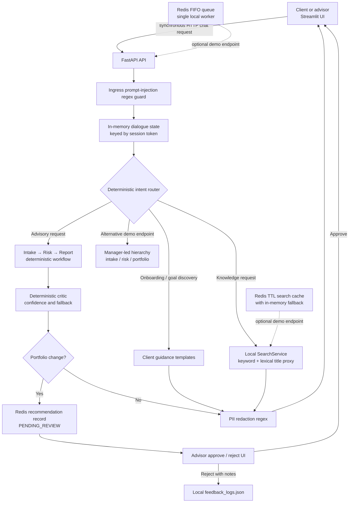

# AuraWealth Core — Wealth Management Prototype

AuraWealth is a local FastAPI and Streamlit prototype for a consumer wealth-management experience. It demonstrates a client chat journey, advisor review controls, a simulated knowledge base, deterministic agent-style workflows, and governance controls.

It is an assessment prototype, not an investment-advice service or a production deployment. All portfolio data, market information, recommendations, model labels, and knowledge documents are simulated.

## What is implemented

| Area | Current implementation |
| --- | --- |
| Client experience | Streamlit chat with local JSON history, financial-goal onboarding, and a client/advisor demo role switch. |
| Backend | FastAPI routes, `async` route handlers, a lifespan-managed Redis queue worker, and a `BackgroundTasks` simulation endpoint. |
| Conversational workflow | Deterministic Intake → Risk → Report stages, a deterministic critic score/fallback, topic-state tracking, and an alternative manager-led hierarchical demo workflow. |
| Retrieval | 1,000 locally generated chunks from 10 simulated documents; keyword matching, lexical title matching labelled as a semantic proxy, hybrid merge/deduplication, metadata filters, and a 2026 recency score of 1.5. |
| Governance | Regex ingress prompt-injection blocking, regex egress PII redaction, advisor feedback logging, deterministic golden-set evaluation, and persisted `PENDING_REVIEW` recommendation state. |
| Scaling demonstrations | Redis TTL cache with in-memory fallback and a Redis FIFO simulation queue with a single in-process consumer. |
| Verification | `pytest` suite covering routes, services, state, governance controls, Redis fakes, and a Streamlit smoke test. |

## Important boundaries

- There is **no LangGraph**, Qdrant, ChromaDB, external vector database, Gemini SDK, OpenAI SDK, or live LLM call in this repository.
- “Semantic search” currently means deterministic lexical title matching, not embeddings or vector similarity. The cluster map uses simulated thematic coordinates, not learned embeddings.
- The main Streamlit chat request currently uses synchronous `httpx.post`; task #31 tracks the async transport remediation.
- The Flash/Pro names and costs returned by `/api/v1/route` and `/api/v1/route/llm` are mock FinOps labels. They do not invoke models and are not yet on the main chat path.
- The client/advisor switch is a presentation demo, not authentication, authorisation, or tenant isolation.
- Chat history and advisor feedback are local JSON files; they are not authenticated, user-isolated, or suitable for regulated customer data.
- Redis is optional for the app to start, but is required for queue and persisted recommendation-review demonstrations. It is a single local instance, not a highly available deployment.
- The evaluator and critic are deterministic scripts, not LLM-as-a-judge. Feedback capture exists; a before/after improvement benchmark is task #37.

## Code-accurate architecture



### Main request lifecycle

1. The Streamlit client sends the user message to `POST /api/v1/orchestrator/route`.
2. FastAPI blocks known instruction-override patterns before workflow execution.
3. A local in-memory dialogue state is updated using the supplied session token.
4. A deterministic intent router selects client guidance, local search, or the sequential advisory workflow.
5. Portfolio-change keywords, including rebalancing and simulations, create a Redis recommendation record with `PENDING_REVIEW`. The client receives only the pending-review notice.
6. An advisor can inspect the advisor-only operational trace, approve the stored report, or reject it with required correction notes. Rejection appends notes to `feedback_logs.json`.
7. Generated content is passed through egress PII redaction before it reaches the UI.

## Retrieval and reranking

`app/seed_data.py` generates exactly 1,000 chunks across 10 simulated documents and attaches category, year, and cluster metadata.

- **Keyword retrieval:** token presence in chunk text or title.
- **Lexical title proxy:** token presence in document titles; exposed as the current semantic-search proxy.
- **Hybrid retrieval:** merges both candidate pools by chunk ID, then removes duplicates.
- **Metadata filters:** category and recency year limit the candidate pool.
- **Reranking:** chunks dated 2026 receive `rerank_score: 1.5`; other chunks receive `1.0`.

This is deliberately local and deterministic for the assessment. Task #33 is the decision point for either a genuine embedding/vector implementation or continued lexical retrieval with these explicit limits.

## Governance controls

| Control | Behaviour and limit |
| --- | --- |
| Prompt-injection guard | Blocks a small regex set of common override/system-prompt requests. It is a demonstration control, not a complete prompt-security solution. |
| PII redaction | Redacts email, Singapore NRIC, SSN, phone, Luhn-valid card number, and common address patterns in outbound text. It is pattern-based and cannot guarantee detection of all sensitive data. |
| Human review | Persists action-oriented recommendations in Redis as `PENDING_REVIEW`; only advisor approval adds the stored report to client chat history. |
| Rejection handling | Requires advisor correction notes in the UI and appends them to local feedback storage. |
| Explainability | Advisor-only operational events record node name, outcome, timestamp, and safe summary. They are execution telemetry, not chain-of-thought. |
| Evaluation | Five deterministic golden cases score required response signals and unsafe guarantee phrases. |

## Local setup

### Prerequisites

- Python 3.11+
- Redis server only for cache, queue, and recommendation-review demos

### macOS preparation (one-time)

If Python 3.11 and Redis are not already installed on the presentation Mac,
install them with Homebrew:

```bash
brew install python@3.11 redis
```

Confirm the runtime before creating the environment:

```bash
python3.11 --version
redis-server --version
```

```bash
git clone https://github.com/namlassalman/kayawealth-core.git
cd kayawealth-core
python3.11 -m venv venv
source venv/bin/activate
pip install -r requirements.txt

# Terminal 1
venv/bin/uvicorn app.main:app --reload

# Terminal 2
venv/bin/streamlit run app/frontend.py --server.runOnSave=true
```

For Redis-backed demos:

```bash
redis-server --daemonize yes
redis-cli ping
```

Run checks before each atomic feature commit:

```bash
venv/bin/pytest -q
```

### Environment profiles

Copy `.env.example` to `.env` for local configuration. The application reads
the file at startup and explicit shell environment variables take precedence.
Invalid profile names, Redis URL schemes, or TTL values fail fast during startup.

| Profile | Cache TTL | Queue job retention | Intended use |
| --- | ---: | ---: | --- |
| `DEV` | 10 seconds | 10 minutes | Local demonstrations and quick cache-expiry checks. |
| `TEST` | 60 seconds | 1 hour | Automated/integration testing. |
| `PROD` | 5 minutes | 24 hours | Prototype production profile only; not a production deployment guarantee. |

`REDIS_URL`, `CACHE_TTL_SECONDS`, and `QUEUE_JOB_TTL_SECONDS` may override
the profile defaults. Use **Operations Diagnostics → Environment Profile** in
Streamlit, or `GET /api/v1/system/config`, to verify the active non-sensitive
runtime settings. Do not commit `.env` files containing deployment secrets.

## Demonstration paths

### Client and advisor governance path

1. In Client mode, submit `Run agent simulation for my retirement account.`
2. Confirm that the client sees `PENDING_REVIEW`, not the raw advisory report.
3. Switch to Wealth Advisor mode, review the trace and stored report, then approve or reject it.
4. On rejection, enter notes such as `Reduce international equity exposure by 5%.`; verify the report is not delivered and the critique is written locally.

### Knowledge and operations paths

- In **Client-facing tools**, search `tax` or `compliance`, filter to 2026, and inspect the visible `1.5` recency score.
- In **Operations Diagnostics**, run the cache check twice to observe a miss followed by a hit when Redis is available.
- Queue three demo jobs to observe ordered local FIFO processing.
- In **Wealth Advisor tools**, run the alternative manager-led hierarchy and the deterministic golden-set evaluator.

## Panel defence notes

### Why deterministic workflows rather than a live LLM?

The assessment prototype prioritises reproducibility, safe local demonstration, testability, and explicit governance boundaries. The agent topology is represented by isolated services and structured state rather than an opaque live-model call. A production integration would place an approved model provider behind an interface with tenant isolation, audit logging, evaluation gates, rate limits, and policy controls.

### Why Redis?

Redis is used locally to demonstrate TTL caching, FIFO job processing, and durable review records across application interactions. Production design would require managed Redis, encryption, network boundaries, availability/backup strategy, monitoring, and data-retention controls.

### What would production scale require?

Stateless API replicas behind a load balancer; authenticated, tenant-scoped persistence; managed queue/cache services; a genuine retrieval index with governed document ingestion; model-provider abstraction; tracing and metrics; and formal data-governance controls. These are target architecture considerations, not implemented capabilities.

## Repository map

```text
app/main.py                    FastAPI routes and orchestration composition
app/frontend.py                Streamlit client/advisor experience
app/services/search.py         Local lexical retrieval, hybrid merge, reranking, clusters
app/services/dialogue.py       Dialogue-focus state transitions
app/services/orchestration.py  Intent routing and mandate-conflict detection
app/services/hierarchical.py   Alternative manager-led workflow demo
app/services/cache.py          Redis TTL cache with in-memory fallback
app/services/redis_queue.py    Redis FIFO simulation queue and local worker
app/services/recommendations.py Persisted PENDING_REVIEW records
app/services/evaluation.py     Deterministic golden-set scoring
app/ui/                        Streamlit advisor and sidebar panels
tests/                         Service, API, model, and frontend smoke tests
```

## Task status

Completed features are committed atomically in Git history. `TASKS.md` is maintained locally for board tracking; task #38 will reconcile its stale status labels and commit evidence. The next high-risk documentation follow-up is task #41, a final presentation walkthrough after remaining implementation work is complete.
