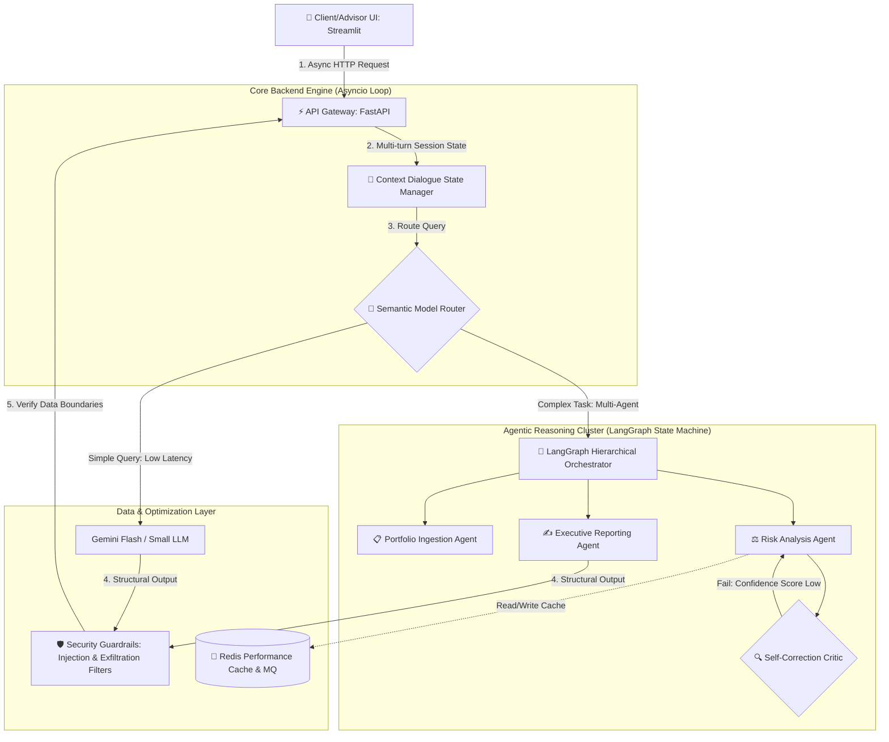

# AuraWealth: Core Enterprise Infrastructure Prototype

AuraWealth is an asynchronous, event-driven, agentic-first consumer wealth management engine that bridges the gap between high-touch human advice and digital efficiency. It replaces fragmented spreadsheets with an automated command center for wealth managers, handling automated client portfolio reviews, risk analysis, and collaborative real-time client-advisor communication workflows.

This repository contains the core architectural skeleton, advanced RAG infrastructure, and security guardrails built during a 5-day unsupervised technical assessment.

---

## 🏗️ Core Architecture Overview
- **Orchestration Framework:** LangGraph (State Graph Engine)
- **Backend Infrastructure:** FastAPI (Fully Asynchronous Event Loop)
- **Vector Engine:** Qdrant / ChromaDB (Hybrid Vector & Keyword Search)
- **Event & Performance Layer:** Redis (Async Caching, Session Memory, Message Queue)
- **Strategic AI Safety:** Dual-layer guardrails (Prompt Injection & Exfiltration Defense) + Automated Evaluators

---

## 📊 System Design Diagram



---

## 🗺️ Deep-Dive Architecture End-to-End Walkthrough

To ensure architectural fluency during live stress-testing, an incoming user query moves through our decoupled system using the following data lifecycle pathways:

### 1. Unified Interface Entry (Streamlit)
*   The client or wealth advisor interacts with an in-app chat interface driven natively by `st.chat_input` and managed using continuous `st.session_state` parameters to lock state against top-to-bottom UI reruns.
*   The UI dispatches asynchronous, non-blocking requests to the backend using `httpx.AsyncClient` inside a thread-isolated event loop container.

### 2. Async Routing & Triage Layer (FastAPI Semantic Router)
*   The system intercepts payloads at the FastAPI API Gateway. Rather than immediately booting heavy execution logic for trivial entries, a lightweight **Semantic Router** inspects the incoming user string intent.
*   **The Low-Cost Path (FinOps Optimization):** If the query represents basic conversational greetings (*"Hi"*, *"Help me log in"*), traffic triggers a light, cost-effective LLM tier (Gemini Flash), bypassing downstream database clusters entirely.
*   **The Premium Path (Multi-Agent RAG Engine):** Heavy advisory prompts (*"Audit my high-risk tax liability"*) bypass the low-cost route and trigger our advanced data ingestion and multi-agent reasoning cluster.

### 3. Knowledge Ingestion (Hybrid Search RAG Pipeline)
*   The system parses structural documents using a deterministic data generator script that populates exactly 1,000 document text fragments locally.
*   A **Hybrid Search Workflow** runs in parallel—combining a semantic search matcher and a deterministic keyword dictionary. Results are merged, stripped of duplicate fragments, and ordered using a custom **Recency-Weighted Reranker** to guarantee the model prioritizes up-to-date market realities.

### 4. Coordinated Decision Architecture (LangGraph Multi-Agent)
*   Complex analysis tasks drop directly into a **Hierarchical Orchestrator** framework. The lead orchestrator breaks the task down into structural sub-problems, distributing assignments across three specialized execution blocks:
    1.  **InTake Agent:** Validates client structural assets and portfolio inputs.
    2.  **Risk Analyst Agent:** Measures profile volatility against internal governance benchmarks.
    3.  **Portfolio Reviewer Agent:** Formulates algorithmic rebalancing strategies.
*   **Self-Correction Loops:** Draft data passes to an internal **Self-Correction Critic**. If the model's confidence ranking registers beneath an 80% baseline, the task is safely rejected, looping backward to self-correct instructions dynamically.

### 5. Enterprise Data Governance & Interception Gates
*   **Human-In-The-Loop (HITL) Gatekeeping:** Portfolio allocation proposals are explicitly halted at a `PENDING_REVIEW` database state. They are never pushed directly to a client. Wealth managers must click **Approve** or **Reject** in their command portal.
*   **Feedback Integration:** To satisfy continuous optimization requirements, advisors can write explicit correction logs alongside a rejection event. These text correction notes populate an internal feedback store, augmenting future prompt context data to scale individual advisor precision natively.
*   **Exfiltration Protection:** Before any generated text travels upstream back to the client UI, a security parsing step scrubs strings using regex patterns to redact PII (Social Security numbers, account IDs, and contact info).

---

## 📅 Rebalanced 4-Day Sprint Task Roadmap

This master delivery schedule governs feature rollouts across isolated, atomic git commits to align with technical assessment scoring rules:

### Section 1: Core & Advanced Core Engine [3.0 Hours]
- **Issue #1: 3-Agent Sequential Workflow (1.5h | Medium)**: Scaffold sequential text hand-offs between Portfolio, Risk, and Executive report builders.
- **Issue #20: Current System Design Diagram (0.5h | Low)**: Map state pathways and maintain documentation accuracy.
- **Issue #2: Multi-Turn Dialogue State Management (1.0h | Medium)**: Handle runtime topic-switching parameters gracefully without losing operational memory context.

### Section 2: Smart Knowledge Base (RAG & Search) [5.0 Hours]
- **Issue #22: Mock Data Ingestion (1.5h | Medium)**: Write `seed_data.py` to auto-generate 1,000 distinct structural local data fragments.
- **Issue #3: Metadata-Enhanced Semantic Search (1.0h | Medium)**: Tag and filter text fragments by business categories.
- **Issue #6: Embedding Clustering Visualization (0.5h | Low)**: Render scatter metrics on the UI to demonstrate data thematic relationships.
- **Issue #4: Hybrid Search Workflow (1.0h | Low)**: Implement a unified deduplication layer combining vector and keyword outputs.
- **Issue #5: Custom Recency-Weighted Reranker (1.0h | Medium)**: Adjust algorithm scores to favor fresh date attributes.

### Section 3: Agentic Intelligence & Autonomy [4.5 Hours]
- **Issue #7: Hierarchical Orchestrator Agent (1.5h | High)**: Formulate main routing controller logic to mitigate infinite tracking loops.
- **Issue #8: Self-Correcting Reflection Loop (1.0h | High)**: Design score review parameters to trigger internal generation re-runs.
- **Issue #9: Performance Feedback Loops (1.0h | Low)**: Deploy interactive upvote/downvote widgets to log response flaws.
- **Issue #10: Session-Persistent Context Memory (1.0h | Medium)**: Structure local disk-cached files tracking distinct session keys.

### Section 4: Enterprise Data Governance & Safety [5.0 Hours]
- **Issue #11: LLM-as-a-Judge Automated Eval (1.5h | Medium)**: Build comparison matrices evaluating outputs against fixed golden test sets.
- **Issue #12: Prompt Hacking Guardrails (0.5h | Low)**: Intercept malicious character sequences at the gateway layer.
- **Issue #13: Info Exfiltration Blockers (1.0h | Medium)**: Strip out high-risk patterns matching PII rules before client rendering.
- **Issue #14: Human-in-the-Loop Interception & Critique Logging (1.5h | High)**: Construct a portal block freezing execution flow until the manager provides optional text critique comments.
- **Issue #15: Workflow Reasoning Explainability Logs (0.5h | Low)**: Build a collapsible visual interface block rendering internal thoughts.

### Section 5: Production Scaling & Infrastructure [3.5 Hours]
- **Issue #16: Semantic Routing Layer (1.0h | Medium)**: Route incoming user query metrics across distinct small and large models.
- **Issue #17: Redis Performance Cache with TTL (1.0h | Medium)**: Handle key-value expiration limits for fast responses.
- **Issue #18: Redis Background Message Queue (1.5h | High)**: Sequence high-traffic jobs inside serialized data loops.

---

## 🚀 Getting Started

### Prerequisites
- Python 3.11+
- Redis Server
- API Keys: Gemini Enterprise / Cursor Environment Config

### Installation & Setup
```bash
# Clone the repository
git clone <your-repo-url> kayawealth-core
cd kayawealth-core

# Setup virtual environment
python3 -m venv venv
source venv/bin/activate

# Install dependencies
pip install -r requirements.txt

# Run the backend server
uvicorn app.main:app --reload

# Run the frontend portal
streamlit run app/frontend.py
```
